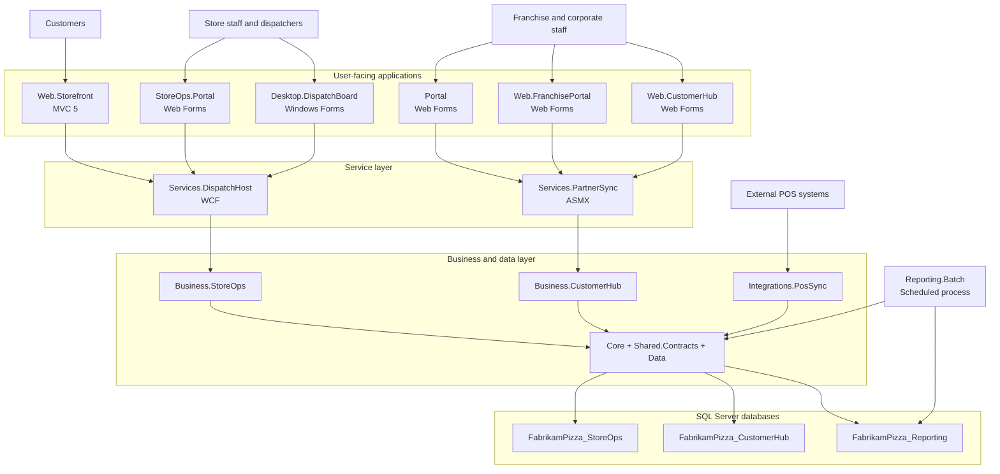

# Enterprise Modernization Sample

**Fabrikam Enterprise Pizza** is a sample legacy .NET Framework enterprise application representing a regional pizza franchise platform. The repository captures the system before and after modernization, with the legacy estate centered on multi-project web, desktop, service, integration, and SQL Server components.

## Business domains

- **StoreOps** — ordering, dispatch, delivery routes, workforce operations, and POS coordination
- **CustomerHub** — corporate accounts, catering, franchise relationships, and partner workflows
- **Reporting** — nightly rollups, delivery KPIs, labor summaries, and operational scorecards
- **Commerce edge** — public ordering through the web storefront

## Legacy solution inventory

### User-facing applications
- **ASP.NET Web Forms:** `Portal`, `StoreOps.Portal`, `Web.FranchisePortal`, `Web.CustomerHub`
- **ASP.NET MVC 5:** `Web.Storefront`
- **Windows Forms:** `Desktop.DispatchBoard`

### Services and integration
- **WCF service:** `Services.DispatchHost`
- **ASMX service:** `Services.PartnerSync`
- **POS integration:** `Integrations.PosSync`
- **Batch processing:** `Reporting.Batch`

### Business and shared libraries
- **Business logic:** `Business.StoreOps`, `Business.CustomerHub`
- **Shared libraries:** `Core`, `Shared.Contracts`, `Data`

### Databases
- **SQL Server:** `FabrikamPizza_StoreOps`, `FabrikamPizza_CustomerHub`, `FabrikamPizza_Reporting`

## System topology

The topology below summarizes the legacy runtime shape. For more detailed architecture notes, see `docs\before\solution-architecture.md`.



## Repository structure

- `src\before\` — legacy .NET Framework solution and projects
- `src\after\` — modernized target solution space
- `docs\` — before/after architecture and supporting documentation
- `data\` — SQL Server assets and sample data artifacts
- `scripts\` — helper scripts for legacy validation and setup

## Building and testing

The canonical legacy solution entry point is `src\before\Fabrikam.EnterprisePizza.Legacy.sln`.

```powershell
nuget restore src\before\Fabrikam.EnterprisePizza.Legacy.sln
dotnet msbuild src\before\Fabrikam.EnterprisePizza.Legacy.sln /t:Build /p:Configuration=Debug
powershell -ExecutionPolicy Bypass -File .\scripts\Invoke-LegacyNUnit.ps1 -AssemblyPath .\src\before\Fabrikam.EnterprisePizza.Tests.Unit\bin\Debug\Fabrikam.EnterprisePizza.Tests.Unit.dll
```
